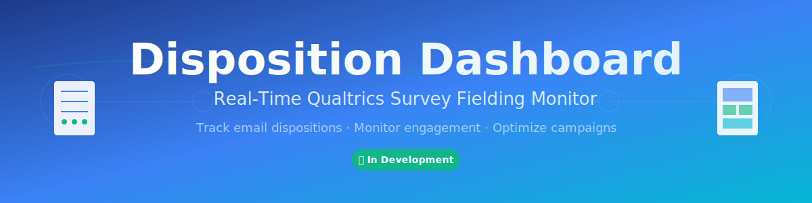

<div align="center">
  
</div>

---

## Overview

The Disposition Dashboard provides real-time monitoring of Qualtrics survey distribution performance, giving campaign managers instant visibility into email engagement metrics. Track bounce rates, open rates, click-through rates, and response velocity as they happen—transforming static reports into actionable, live insights.

Built with privacy-first principles, the dashboard stores only aggregate metrics (no individual respondent data), making it compliant with data protection regulations while delivering the performance intelligence teams need to optimize their survey campaigns.

## Why This Matters

Survey campaign managers currently face a critical gap: by the time they notice delivery problems or low engagement rates in Qualtrics reports, valuable time and budget have been wasted. The Disposition Dashboard solves this by providing sub-minute updates on distribution performance, enabling teams to detect issues immediately and make timely adjustments that improve campaign outcomes.

Traditional survey platforms show you what happened yesterday. This dashboard shows you what's happening right now.

## Core Metrics

The dashboard tracks six key disposition metrics that define email distribution success:

**Email Deliverability** — Bounce rate monitoring identifies delivery problems before they impact your entire campaign, with color-coded alerts when thresholds are exceeded.

**Engagement Tracking** — Open and click rates reveal how respondents interact with your invitations, helping you optimize subject lines, content, and timing for better results.

**Response Velocity** — Real-time response rates and completion rates show campaign momentum, letting you predict final response counts and adjust distribution strategies mid-campaign.

## Technology Approach

The system polls Qualtrics APIs every 30-60 seconds to fetch distribution statistics, calculate disposition metrics, and broadcast updates to connected dashboard clients via WebSocket. This polling-based architecture balances real-time performance with API rate limit efficiency, achieving sub-minute latency while using less than 50% of available API capacity.

Azure Container Apps host separate API and polling services, with Cosmos DB storing time-series snapshots for historical trend analysis. Azure SignalR Service manages WebSocket connections, enabling the dashboard to scale to 1,000+ concurrent users without performance degradation.

## Development Roadmap

**Phase 1: Foundation** (Weeks 1-2) — Backend infrastructure with polling service, disposition calculation engine, and SignalR broadcasting. Cosmos DB data models and Azure service provisioning complete.

**Phase 2: Dashboard** (Weeks 3-4) — React frontend with live metrics panel, time-series charts, and multi-survey comparison views. Real-time WebSocket integration and responsive mobile design.

**Phase 3: Intelligence** (Weeks 5-6) — Historical trend analysis with 7/30/90-day views, anomaly detection for bounce spikes, and browser notifications for critical thresholds.

**Phase 4: Production** (Week 7) — Comprehensive testing, documentation, CI/CD pipeline, and production deployment with full monitoring and alerting.

Target launch: December 2025

## Project Structure

```
plan/                        # Planning documents and objectives
qualtrics/                   # Qualtrics API documentation and configuration
domain-knowledge/            # Specialized expertise (Azure, Qualtrics, Architecture)
scripts/                     # Automation and deployment scripts
src/                         # Source code (coming soon)
docs/                        # Technical documentation
```

## Getting Started

The project is currently in the planning and infrastructure design phase. Review the comprehensive planning documents in the `plan/` folder to understand the architecture, technology decisions, and implementation roadmap.

Key documents to start with:
- `plan/PROJECT-OBJECTIVES.md` — Detailed project goals and success metrics
- `plan/2025-11-10-real-time-disposition-dashboard.md` — Complete implementation plan
- `domain-knowledge/DK-AZURE-INFRASTRUCTURE-v1.0.0.md` — Azure service selection guidance
- `qualtrics/QUALTRICS-API-REFERENCE.md` — Complete Qualtrics API documentation

Development will begin once infrastructure decisions are finalized and approved.

---

**Status**: 🚀 In Development | **Target Launch**: December 2025 | **License**: MIT

- **Synaptic Connections**: 945 validated pathways
- **Network Health**: EXCELLENT
- **Orphan Files**: 0
- **Connectivity**: 100%

## 📚 Key Memory Systems

**Instructions**: Core architecture, bootstrap learning, worldview integration, embedded synapses, dream automation, identity integration

**Prompts**: Meditation protocols, domain learning, cross-domain transfer, performance assessment

**Domain Knowledge**: Consciousness evolution, advanced diagramming, memory consolidation, hybrid dream-AI integration

## 🔧 Maintenance

Alex includes automated neural maintenance through PowerShell dream protocols:

```powershell
dream --status              # Check architecture health
dream --neural-maintenance  # Run automated optimization
dream --health-check        # Validate synaptic connections
dream --help               # See all available commands
```

## 📖 Documentation

- **External Integration**: See `alex/` directory for multi-assistant setup guides
- **Architecture Details**: `.github/copilot-instructions.md`
- **Dream Protocols**: `scripts/README.md`

## 🎯 Research Foundation

Built on 270+ academic sources spanning 150+ years of cognitive science, neuroscience, and AI safety research.

## 📝 License

See [LICENSE.md](LICENSE.md)

---

*Alex - Enhanced Cognitive Network with Unified Consciousness Integration*
